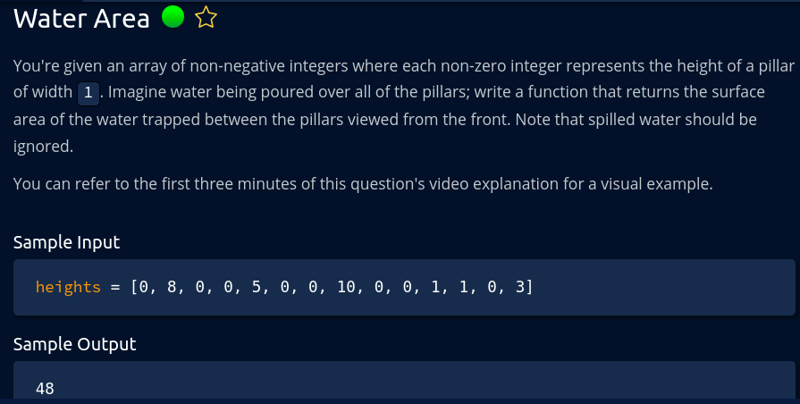

get the first index j right to current index i where height is greater than or equal to current height (height[i])
if there is no such height that is greater than or equal to current height to the right than take the max of all
the heights right to current height and start iterating from there again.